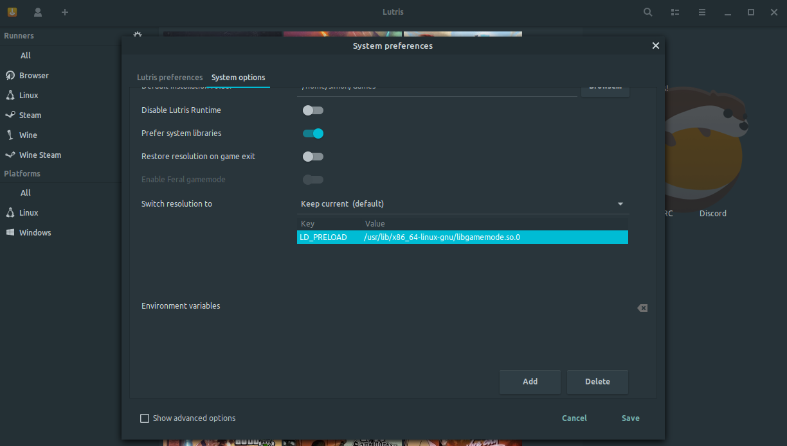

1. `sudo add-apt-repository ppa:samoilov-lex/gamemode`
2. `sudo apt install gamemode`

lib = sudo find /usr/ -name libgamemodeauto.so.0
ADD THE lib TO LUTIRS

-> [see](https://github.com/FeralInteractive/gamemode)
